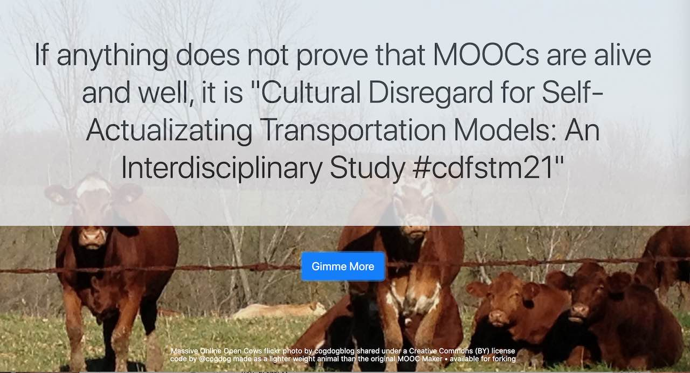

# MOOC Maker

Some fun at being a generator of fictitious (I hope) names for Massive Online Open Courses (MOOOOOOOOOOOOOOOC)

by Alan Levine https://cog.dog or http://cogdogblog.com/

-----

## About This Bovine Operation
This is an HTML/Javascript rendition of a previously made [PHP version of a generator](http://mooc.cogdogblog.com/) for making crazy course names. 

[Just go try it](https://cogdog.github.io/moocmaker/)

The structure draws from arrays for the parts, or from the example above

* **Subject** ("Cultural Regards For")
* **Adjective** ("Self-Actualizing")
* **Topic** ("Transportation Models")
* **After the Colon** ("An Interdisciplinary Study")

The hashtags are string together from the first letter of everything before the colon.

More randomness comes into the different ways the text is presented, including random names of MOOC providers and bloggers.

This was modeled a bit after the [EdTech Metaphor Generator](https://github.com/cogdog/edtechaphors), but this one has extra doses of randomness.

If you want to join in and add some fertilizer, just make edits and submit as change requests to the feedlot.
